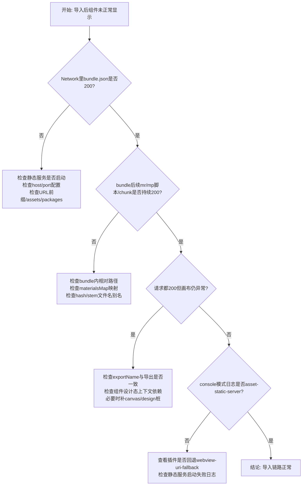

# 插件与设计器物料导入对接与排障

> 目标读者：设计器开发人员（`designer-demo`）  
> 目的：明确 VSCode 插件与设计器在「AM 导入物料」链路中的职责、成功判定标准与排障流程。

---

## 0. 端到端流程图

```mermaid
flowchart TD
    A[主工程构建物料ZIP<br/>bundle.json + mr/mp脚本 + 样式/chunk]
    B[插件AM导入ZIP<br/>落盘到 src/lowcode/assets/packages/id]
    C[插件静态服务启动<br/>http://host:port/assets/packages/...]
    D[插件注入全局变量<br/>TINY_MATERIAL_BUNDLE_URLS<br/>TINY_DESIGNER_MATERIALS_MAP]
    E[设计器 useMaterial 加载bundle<br/>updateCanvasDeps下发到画布]
    F[画布 iframe import(scriptUrl)<br/>加载mr-components.js / mp-*.js]
    G{加载结果}
    H[成功<br/>面板可见 + 组件可拖拽渲染<br/>Network持续200同域]
    I[失败<br/>按文档分层排障<br/>bundle404/chunk404/渲染异常]

    A --> B --> C --> D --> E --> F --> G
    G -->|通过| H
    G -->|异常| I
```

---

## 一、对接背景（当前主链路）

当前物料导入主链路是：

1. 主工程产出物料压缩包（内含 `bundle.json`、`mr-components.js`、`mp-*.js`、样式与 chunk）。
2. 插件 Asset Manager 导入 ZIP 到工作区：`src/lowcode/assets/packages/<package-id>/`。
3. 插件端启动内建静态服务（HTTP），并把物料 URL 注入到设计器 webview：
    - `window.TINY_MATERIAL_BUNDLE_URLS`
    - `window.TINY_DESIGNER_MATERIALS_MAP`
4. 设计器读取上述全局变量，走既有 `useMaterial` 加载流程，画布 iframe 通过 `import(scriptUrl)` 加载组件。

---

## 二、职责边界（谁负责什么）

### 2.1 插件侧职责

-   维护 AM 资产目录与索引；
-   启动静态服务并暴露 `http://<host>:<port>/assets/packages/...`；
-   向 webview 注入 bundle URL 与文件映射；
-   提供服务状态/日志，支持失败时回退策略。

### 2.2 设计器侧职责

-   消费插件注入变量（而不是假设固定本地目录）；
-   把 bundle 合并进物料源并下发到画布；
-   在画布中正确动态加载 ESM 组件和样式；
-   提供清晰诊断（当前模式、URL 样例、加载结果）。

### 2.3 不建议的职责混淆

-   设计器不应自行假设 AM 包的磁盘路径；
-   设计器不应依赖 `vscode-resource/file+` 作为主链路；
-   插件不应把“设计器内部 import 逻辑”硬编码在扩展层。

---

## 三、导入成功判定（设计器维护者必看）

满足以下条件，才算“导入成功”：

1. **Bundle 请求成功**
    - Network 首个物料请求为：
    - `http://<host>:<port>/assets/packages/<id>/bundle.json`
    - 状态为 200。
2. **后续资源同域加载**
    - `mr-components.js`、`mp-*.js`、样式和 chunk 继续走同一 host/port/prefix。
3. **画布可用**
    - 物料面板可见；
    - 拖拽组件可渲染，不出现大面积红错或空白。
4. **模式日志一致**
    - 浏览器控制台出现：`material URL mode: asset-static-server`。

> 仅有 `bundle.json` 200，不代表成功；后续 ESM/chunk 持续成功才算闭环。

---

## 四、调试方式（按场景）

## 4.1 正常 AM 调试（推荐、验收必须）

前提：插件 `DEBUG_HARDCODE_MATERIAL_INJECTION = false`。

步骤：

1. 在 AM 导入 ZIP。
2. Reload Extension Host（尤其修改过静态服务配置后）。
3. 查看浏览器 Network：
    - 先看 `bundle.json`；
    - 再看 `mr-components.js`、`mp-*.js`、`mr-bank.css`、chunk。
4. 查看浏览器 Console：
    - `material URL mode` 是否为 `asset-static-server`；
    - 是否有 URL 样例输出。
5. 查看 VSCode 输出面板：
    - `Lowcode Asset Static Server` 是否显示 started + serving path。

## 4.2 硬编码调试（仅临时定位）

前提：插件 `DEBUG_HARDCODE_MATERIAL_INJECTION = true`。

用途：

-   快速复现实验；
-   暂时绕开 AM 索引，验证某个固定 bundle 是否可加载。

注意：

-   该模式不代表 AM 正常链路；
-   不可作为最终验收依据。

---

## 五、常见故障分层排查

### 5.0 排障决策图



### A. `bundle.json` 404

优先判断：

-   URL 前缀是否正确（`/assets/packages/`）；
-   `<id>` 是否对应真实导入包目录；
-   插件静态服务是否启动成功（输出面板）。

### B. `bundle.json` 200 但 `mr-components.js` / `mp-*.js` 404

优先判断：

-   `bundle.json` 内脚本路径与静态服务目录是否对应；
-   是否存在 hash 文件名与 stem 文件名不一致问题；
-   `materialsMap` 是否含对应文件映射。

### C. 全部请求 200 但画布仍空白

优先判断：

-   模块导出名与 `npm.exportName` 是否一致；
-   组件在设计态是否依赖运行时上下文（store/router/i18n）；
-   是否需要设计态桩或兼容组件。

### D. 模式退回 `webview-uri-fallback`

优先判断：

-   静态服务是否被禁用；
-   端口范围是否冲突；
-   插件启动失败是否有 warning。

### E. 物料面板组件显示 2 倍 / 3 倍，或主工程晚到、画布先红后好

优先阅读：

-   [物料面板冷启动与重复展示修复经验.md](./物料面板冷启动与重复展示修复经验.md)

快速自检（Console 过滤 `MaterialsDiag`）：

-   不应再出现 `runExclusiveColdStart unavailable` / `fallback forceLoad only`；
-   应看到 `clear + load once`、`forceLoad: done { loaded: 2 }`、`hasMainProject: true`；
-   面板各组肉眼一份；若仅 `htmlChildCount` 偏大但 UI 正常，属已知数据层隐患，改前先评估。

---

## 六、建议的最小回归用例

每次改插件/设计器物料链路后，至少跑以下用例：

1. 新导入一个 ZIP（新 package id）并验证可加载；
2. 删除旧包后确认旧 URL 不再可用；
3. Reload Extension Host 后重新打开设计器，确认自动恢复；
4. 拖拽至少一个 `mr-*` 与一个 `mp-*` 组件验证渲染。

---

## 七、相关文档

-   插件侧维护文档：`lowcode-kit/packages/vscode/docs/asset-static-server.md`
-   设计器总览：`designer-demo/docs/物料导入快速参考.md`
-   VSCode 集成：`designer-demo/docs/VSCode-Integration.md`
-   面板多倍 / 冷启动：`designer-demo/docs/物料面板冷启动与重复展示修复经验.md`
-   历史问题记录：`designer-demo/docs/MATERIALS_ISSUES_AND_EXPECTATIONS.md`
