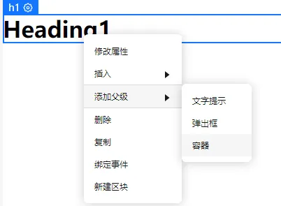
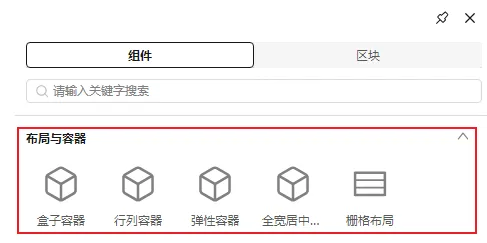
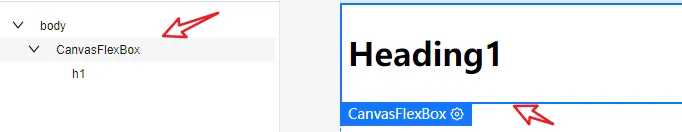
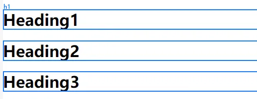
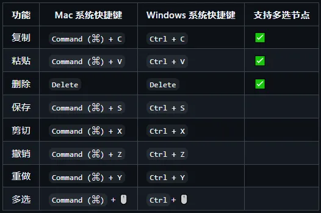

# 画布快捷操作

## 支持画布选中元素右键添加父容器

• 在画布中右键页面元素 -> 添加父级 -> 容器：

• 选中指定 容器 点击 鼠标左键：

• 点击 画布元素 或 点击 大纲树 ， 即可查看新增的父容器

## 支持节点多选

长按 ctrl + 鼠标单击，可支持元素多选，多选节点后可以结合快捷键可以实现批量复制、粘贴、删除操作。（多选节点后右键菜单能力后续版本持续完善）

## 快捷键梳理

目前系统支持上述快捷键对画布元素进行操作，其中 复制、粘贴 和 删除 支持多选节点后进行批量操作。
