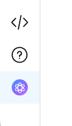
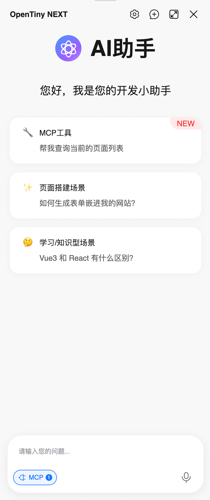
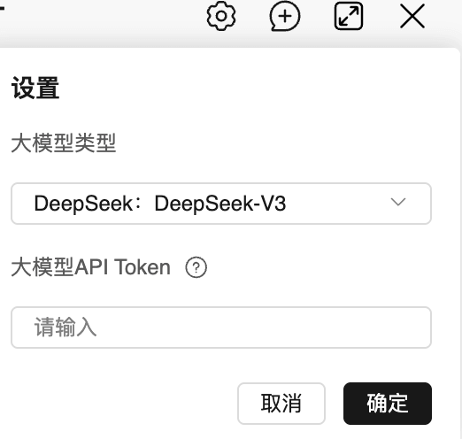
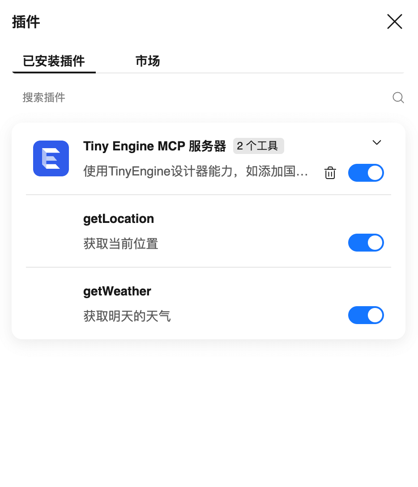
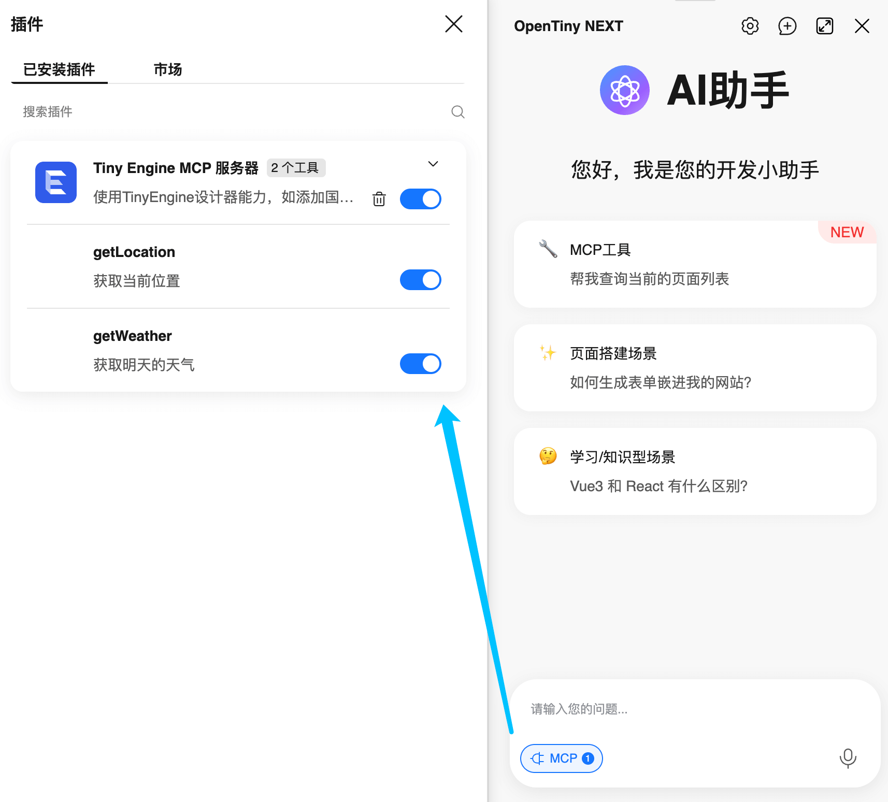
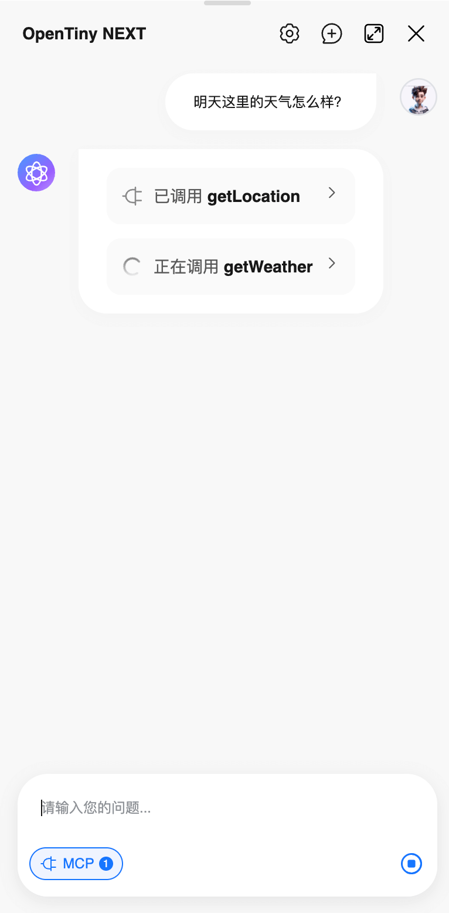
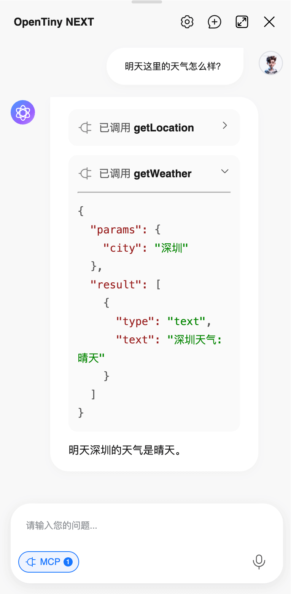
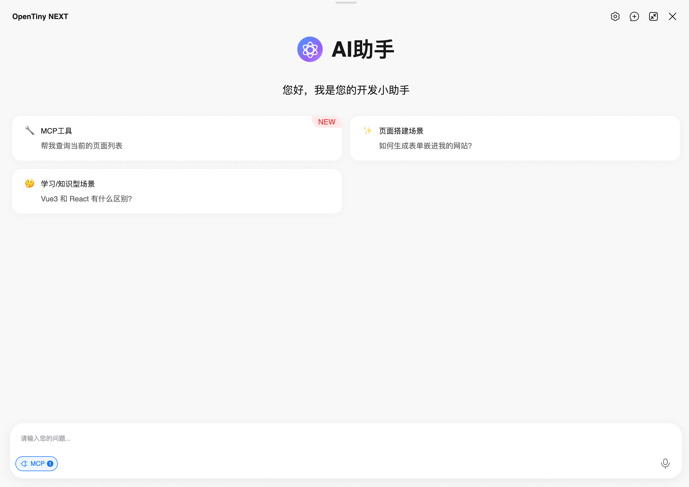

# 新版AI插件使用指南

随着TinyEngine低代码平台的不断升级，AI插件也迎来了重大更新。新版AI插件(v2.8以上版本)采用了全新的TinyRobot组件库界面，同时通过使用OpenTiny Next SDK 集成了MCP（Model Context Protocol）工具使用能力，使AI能够调用平台各插件提供的工具能力，实现更强大的自动化操作功能。

## 一、功能概览

新版AI插件具备以下核心功能：

1. **全新UI界面**：采用TinyRobot组件库，提供更现代化的聊天体验，支持Markdown语法、支持全屏模式等
2. **智能对话**：支持与AI进行自然语言交互，完成复杂任务
3. **Next SDK 与 MCP工具集成**：可以调用平台插件提供的各种工具，如修改属性、修改样式、创建页面等

## 二、界面介绍

### 2.1 主界面

在编辑器界面左下角插件栏，您可以看到 AI 助手的图标。点击图标即可打开主界面对话窗口。



主界面包含以下元素：
- **欢迎区域**：显示AI助手的欢迎信息
- **提示项**：快速开始的常用问题示例
- **对话区域**：显示用户与AI的对话历史
- **输入区域**：用户输入问题的地方
- **MC工具按钮**：管理和配置MCP工具的入口



### 2.2 设置

点击顶部的设置图标，可以进行以下配置：
- 选择 AI 模型：支持多种大型语言模型
- 设置 API Token：配置访问 AI 服务所需的认证信息



注意：切换 AI 模型会开启新的会话。


### 2.3 MCP工具管理



MCP工具管理面板允许用户：
- 查看启用的MCP服务器
- 启用/禁用特定的MCP工具
- 添加新的MCP服务器（即将开放）

## 三、基础使用流程


### 3.1 设置模型接口

1. [可选] 配置自定义的OpenAI兼容格式的大模型接口

通过AI插件的`customCompatibleAIModels`选项，支持自定义添加OpenAI兼容格式大模型

```javascript
// registry.js
[META_APP.Robot]: {
  options: {
    customCompatibleAIModels: [
      { label: 'SiliconFlow：DeepSeek-V3', value: 'deepseek-ai/DeepSeek-V3', manufacturer: 'siliconflow' },
      { label: 'Qwen：qwen-max', value: 'qwen-max', manufacturer: 'qwen' },
    ]
  }
},
```

2. 配置本地的MCP工具调用使用的AI模型接口Proxy, 方便本地调试，以百炼为例：
```javascript
// vite.config.js
const originProxyConfig = baseConfig.server.proxy
baseConfig.server.proxy = {
  '/app-center/api/chat/completions': {
    target: 'https://dashscope.aliyuncs.com',
    changeOrigin: true,
    rewrite: path => path.replace('/app-center/api/', '/compatible-mode/v1/'),
  },
  ...originProxyConfig,
}
```

### 3.2 打开AI插件

点击设计器左下角的AI图标即可打开AI插件对话框

### 3.3 配置AI模型

首次使用或切换AI模型时，需要进行配置：

1. 点击右上角设置按钮
2. 选择合适的AI模型
3. 输入对应的API Token

### 3.4 开始对话

在输入框中输入问题，按回车或点击发送按钮即可开始对话

## 四、MCP工具使用

### 4.1 MCP工具概览

MCP（Model Connector Protocol）是新版AI插件的核心功能之一。通过MCP，AI可以调用平台中各个插件提供的工具能力，例如：
- 创建新页面
- 修改组件属性
- 修改样式设置
- 查询页面列表
- 添加国际化内容

### 4.2 启用MCP工具

1. 点击输入框左侧的"MCP"按钮打开工具管理面板
2. 查看可用的MCP服务器和工具
3. 启用需要的工具



### 4.3 使用MCP工具

当启用MCP工具后，AI在对话过程中会自动判断是否需要调用相关工具。例如：

1. 用户询问："帮我创建一个用户列表页面"
2. AI识别需要调用"创建页面"工具
3. 自动执行创建页面操作
4. 返回操作结果给用户

工具调用中(以查询天气Mock工具为例)：

工具调用完成后会返回最终结果，也可以点击展开工具调用参数与结果：


## 五、典型使用场景

### 5.1 页面搭建场景 (即将开放)

用户可以通过自然语言描述来生成页面：

```
用户：帮我创建一个包含用户信息表单的页面，需要有姓名、邮箱、手机号字段
AI：好的，我将为您创建一个包含用户信息表单的页面...
[执行创建页面操作]
AI：已完成页面创建，您可以在页面列表中查看新创建的表单页面
```

### 5.2 组件属性修改场景

用户可以通过对话修改画布中组件的属性：

```
用户：将当前选中按钮的文字改为"提交"，颜色改为蓝色
AI：好的，我将为您修改按钮属性...
[执行修改属性操作]
AI：已完成按钮属性修改
```

### 5.3 样式调整场景

用户可以通过自然语言调整组件样式：

```
用户：把页面标题的文字大小调整为24px，居中显示
AI：好的，我将为您调整标题样式...
[执行修改样式操作]
AI：已完成标题样式调整
```

## 六、其他功能

### 6.1 会话管理

- **新建会话**：点击右上角的"新建会话"按钮可以开始新的对话

### 6.2 提示项快速开始

界面提供了几个提示项帮助用户快速开始：
- MCP工具使用
- 页面搭建场景
- 学习/知识型场景

点击任一提示项可以快速发送对应的示例问题。

### 6.3 Markdown 支持

AI 助手支持 Markdown 格式的消息渲染，可以更好地展示：
- 代码片段
- 表格
- 列表
- 等其他富文本内容

### 6.4 全屏模式

点击右上角的展开按钮，可以进入全屏模式，获得更大的对话空间。



## 七、注意事项

1. **保存提醒**：在使用AI插件前，请确保当前页面或区块已保存
2. **网络要求**：使用AI功能需要稳定的网络连接
3. **API Token**：需要配置有效的API Token才能正常使用AI功能
4. **MCP工具依赖**：部分MCP工具需要相应的插件支持才能正常工作

## 八、故障排除

### 8.1 无法连接AI服务

- 检查网络连接是否正常
- 确认API Token是否正确配置
- 检查AI服务是否正常运行

### 8.2 MCP工具无法使用

- 确认相关插件是否已安装并启用
- 检查MCP工具是否已启用
- 查看控制台是否有错误信息

### 8.3 功能异常

- 尝试刷新页面
- 清除浏览器缓存
- 联系技术支持

通过以上介绍，您应该能够熟练使用新版AI插件的各项功能。随着平台的不断发展，AI插件将会支持更多强大的功能，帮助您更高效地进行低代码开发。
