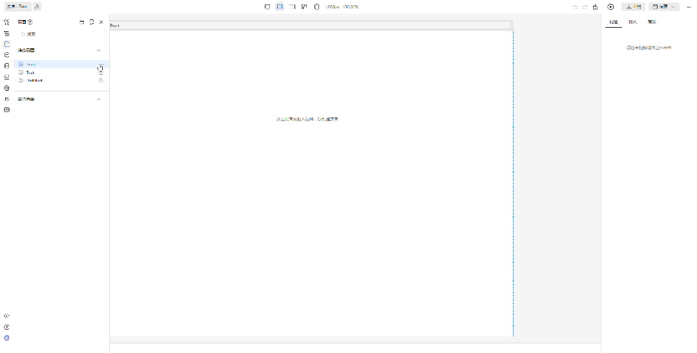

# 页面支持嵌套路由

## 支持静态页面下新建子页面

首先进入页面管理插件，新增一个 Root 页面，新建完成后，悬停 Root 项，点击右侧出现的菜单项，接着点击新建子页面。弹出的表单中，表单项“父文件夹/父页面”会自动填充，填写表单项“页面名称”和“页面路由”然后保存，即可新建一个子页面。这里我们新建一个子页面，名为 Home

   

## 页面树支持拖拽编排

我们先在根目录新建一个页面名为 Intro，新建完成后可以看到 Intro 页面是在顶层。然后拖拽 Intro 页面到 Root 页面下，松开鼠标后页面右上角提示“保存成功”说明拖拽已完成

   

接着再添加一个子页面名为 Docs，你可以参考刚刚添加 Intro 页面的步骤添加 Docs 页面，也可以直接在 Root 页面下新建子页面。最终 Root 页面的树结构为这样

   

## 新增了内置物料，属性配置中新增页面选择器

打开 Root 页面，我们从物料拖入导航条和路由视图。导航条是预设的多个路由链接组成的 snippet，路由链接设置好跳转页面后可以用来跳转到其他路由，路由视图则是子路由插槽。这里的逻辑和 vue-router 是保持一致的，并且最终出码也是使用的 vue-router。在这里我们给每个路由链接设置到对应的路由

   

## RouterLink 增加右键菜单路由跳转，或者通过悬停菜单点击后跳转。画布顶部的路由指示器，也可以点击跳转

如下图操作所示，我们给每个子页面添加一条简单的文本，方面查看当前子页面是哪一个。可以通过点击路由链接的右键菜单来实现路由跳转，需要注意的是，右键菜单只能在当前编辑（激活）页面的组件上生效。所以我们额外增加了一种交互方式，当你悬停在路由链接上时，无论此时路由链接是否能够编辑，可以点击右上角出现的跳转按钮来实现路由跳转

   

## 画布渲染器：支持父子多层级页面嵌套渲染，支持切换页面的时候局部切换刷新

如上图所示，在跳转到子页面后嵌套渲染了父子页面，在子路由之间切换只进行了局部刷新

## 预览时，支持单页预览的时候嵌套视图预览

如下图所示，单页预览子页面时，会同时显示父页面内容。横向导航条属于父页面内容，导航条下面的“我是 Home 页”文本则属于子页面内容

   

## 工具栏增加切换嵌套视图/单页视图

点击页面右上角的菜单按钮，可以查看到新增了“切换到单页/嵌套视图”的选项。使用此选项来进行嵌套视图/单页视图的切换

   

## 最终效果

Root 页面为父页面，拥有3个子页面，分别可以使用导航栏中的路由链接进行跳转。跳转到子页面后同时显示父页面，父子页面嵌套渲染

   

## 出码支持多层级路由嵌套结构的输出

上述应用最终出码的路由文件如下

   