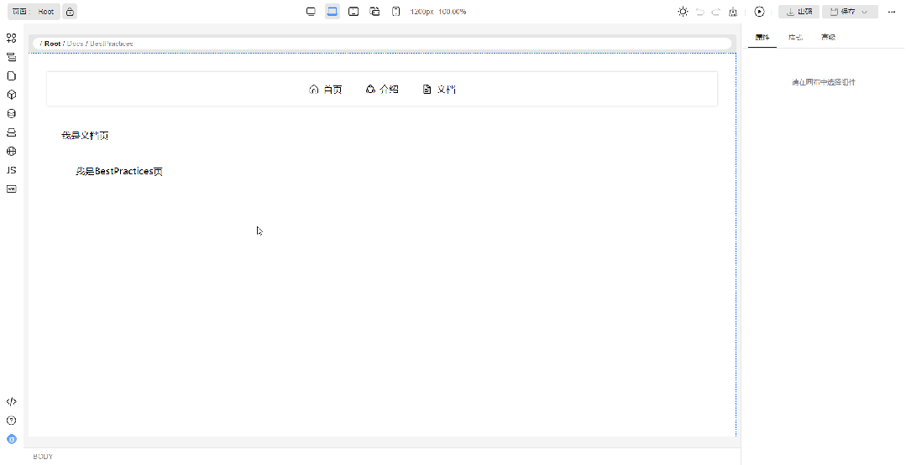

## 路由bar支持一键清除预览页面的路径

如果存在预览路径，当鼠标选听到路由bar上时，会出现“重置路由视图为占位符”的按钮，点击后会将当前编辑页的路由视图重置为占位符。如下图所示，当前编辑页面为Root页面，Root页面的RouterView显示了Docs页面，Docs页面内部的RouterView显示了BestPractices页面，点击“重置路由视图为占位符”的按钮后，Root页面的RouterView重置为了占位符，子页面Docs和嵌套的子页面BestPractices都不再显示

   