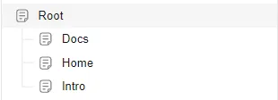
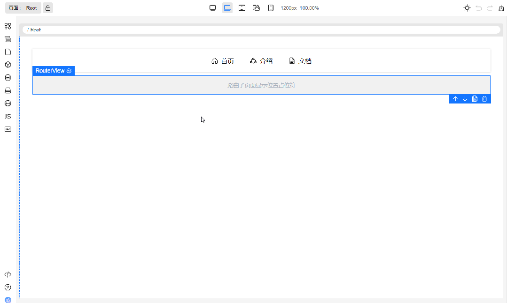
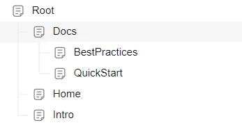
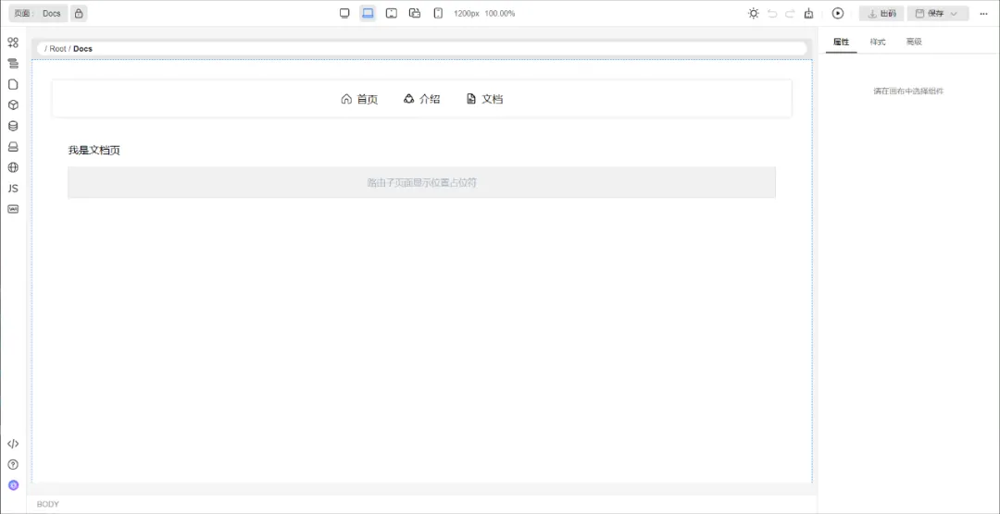
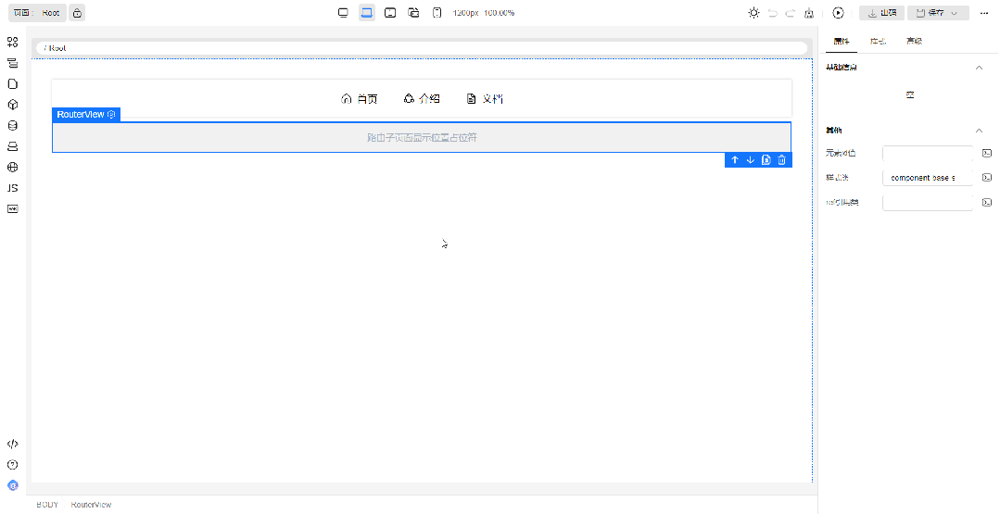

# RouterView组件支持预览子界面

## 为什么需要预览子页面功能？

在父页面拖入RouterView来提供给子页面渲染的插槽，然而在编辑父页面时，我们无法结合子页面内容来实时预览更改后的整体效果，想查看整体效果只能通过单页预览或者出码运行。为了提升这个场景的交互体验，我们推出了RouterView组件支持预览子页面功能。

下面我们逐步创建演示示例来展示路由的新功能。

首先我们创建多个页面，页面结构如下

   

接着在Root页面中拖入横向导航条和路由视图，横向导航条中的路由链接绑定好跳转页面，然后在每个子页面中拖入文本。效果如下所示

   

## RouterView组件支持预览子页面

我们回到Root页面，Root页面中有一个横向导航条和一个RouteView路由视图。悬停RouteView组件，RouteView右上角显示“眼睛”图标，点击此图标用会弹出列表。列表的可选项分为两类：

路由子页面占位符。是列表首个元素，选择后重置RouterView为占位符

RouteView组件所在的页面的子页面，选择任意一个子页面后，RouterView内容会显示子页面

具体效果如下图所示。RouterView中显示了子页面，预览的子页面是只读的（鼠标悬停子页面的组件显示灰色边框，说明是只读的），当前编辑页仍然是Root页面

   

## RouterView组件预览子页面支持嵌套预览

我们将Docs页面稍作修改，首先给Docs页面增加两个子页面分别为QuickStart和BestPractices，这两个子页面也拖入一个基本的文本便于识别，最后在Docs页面中拖入一个路由视图。页面结构和Docs页面预览如下

   

   

我们回到Root页面，将Root页面中的RouterView显示为Docs页面，即使RouterView内部的内容是只读的，嵌套的RouterView仍然可以继续选择要显示的子页面。效果如下图所示

   
