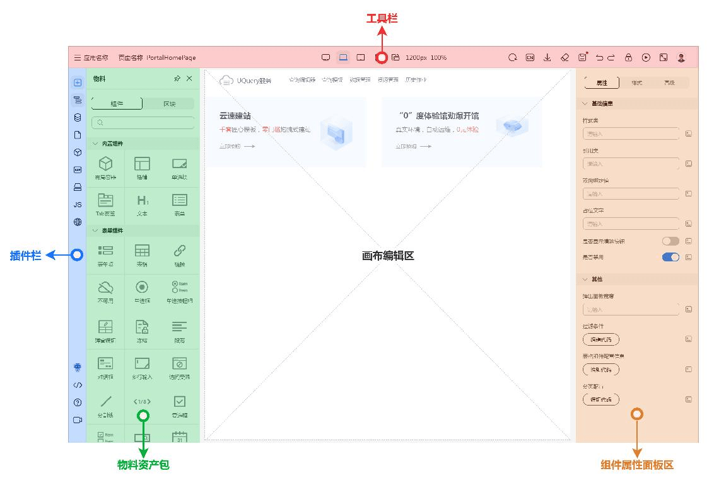
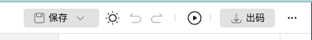
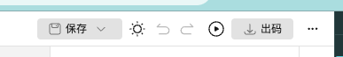
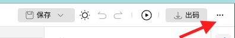
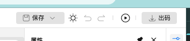

# Layout 插件

## layout 插件

Layout 插件是 Tiny Engine 的核心布局组件，它定义了整个设计器的界面结构。主要包含以下部分：

- 顶部工具栏（Toolbars）
- 左侧插件（Plugins）
- 右侧设置插件（Settings）
- 中间内容区域（Canvas）



### 使用方法

#### 注册表中修改配置

如果我们要修改 layout 插件的配置，我们可以在注册表 `registry.js` 文件中修改配置。

```javascript
export default {
  [META_APP.Layout]: {
    options: {
      // 局部调整插件顺序
      relativeLayoutConfig: {}
      // ... laout 插件配置项
    }
  }
}
```

支持的 options 配置项为：
- configProvider 全局配置组件
- configProviderDesign 规范，可以通过该配置项定制一些自定义的交互规范
- isShowLine 工具栏是否显示分隔线
- isShowCollapse 工具栏是否显示折叠菜单
- layoutConfig 完整布局配置，一旦配置此项，relativeLayoutConfig 将失效
- relativeLayoutConfig 局部调整插件顺序，仅当 layoutConfig 未配置时生效

#### 自定义插件位置

自定义插件位置可以使用 options.layoutConfig 配置项，也可以使用 options.relativeLayoutConfig 配置项。
⚠️注意：当使用 `options.layoutConfig` 配置项时，`options.relativeLayoutConfig` 配置项将失效。

##### 使用 options.relativeLayoutConfig 配置项修改插件位置

options.relativeLayoutConfig 可以局部调整插件位置。
适用场景：仅调整局部的插件位置，或者是增加新插件时，指定顺序。

支持的相对位置有：
- insertBefore 显示在指定的插件前面
- insertAfter 显示在指定的插件后面

使用示例：

```javascript
export default {
  [META_APP.Layout]: {
    options: {
      // 局部调整插件顺序
      relativeLayoutConfig: {
        // 将页面 JS 插件显示在页面管理插件前面
        [META_APP.Script]: {
          insertBefore: META_APP.AppManage
        },
        // 将物料面板显示在状态管理插件后面
        [META_APP.Materials]: {
          insertAfter: META_APP.State
        },
        // 将页面 schema 插件显示在物料插件前面
        [META_APP.Schema]: {
          insertBefore: META_APP.Materials
        },
        // 将保存按钮显示在主题切换按钮前面
        [META_APP.Save]: {
          insertBefore: META_APP.ThemeSwitch
        },
        // 将自定义插件显示在大纲树后面
        'engine.plugins.customPlugin': {
          insertAfter: META_APP.OutlineTree
        }
      }
    }
  }
}
```

##### 使用 options.layoutConfig 配置项修改插件位置

options.layoutConfig 可以全局调整插件位置。
适用场景：调整全局的插件、工具栏的位置，包括新增的插件。
⚠️注意：
1. 使用 options.layoutConfig 配置项时，options.relativeLayoutConfig 配置项将失效
2. 使用该配置项时，需要列举完整的插件列表。没有列举的插件，将不会显示。

默认的布局配置，请参考 [默认布局配置](https://github.com/opentiny/tiny-engine/blob/develop/packages/layout/src/defaultLayout.js)。

使用示例：

```javascript
export default {
  [META_APP.Layout]: {
    options: {
      layoutConfig: {
        plugins: {
          left: {
            top: [
              META_APP.Materials,
              META_APP.OutlineTree,
              META_APP.AppManage,
              META_APP.BlockManage,
              META_APP.Collections,
              META_APP.Bridge,
              META_APP.I18n,
              META_APP.PageController,
              META_APP.State
            ],
            bottom: [META_APP.Schema, META_APP.EditorHelp, META_APP.Robot]
          },
          right: {
            top: [META_APP.Props, META_APP.Styles, META_APP.Event]
          }
        },
        toolbars: {
          left: [META_APP.Breadcrumb, META_APP.Lock, META_APP.Logo],
          center: [META_APP.Media],
          right: [
            [META_APP.ThemeSwitch, META_APP.RedoUndo, META_APP.Clean],
            [META_APP.Preview],
            [META_APP.GenerateCode, META_APP.Save]
          ],
          collapse: [
            [META_APP.Collaboration],
            [META_APP.Refresh, META_APP.Fullscreen],
            [META_APP.Lang],
            [META_APP.ViewSetting]
          ]
        }
      }
    }
  }
}
```

#### isShowLine 是否显示工具栏分隔线

isShowLine 配置项用于控制工具栏是否显示分隔线。

使用示例：

```javascript
export default {
  [META_APP.Layout]: {
    options: {
      isShowLine: false
    }
  }
}
```

显示分隔线示意图：



不显示分隔线示意图：



#### isShowCollapse 是否显示工具栏折叠菜单

isShowCollapse 配置项用于控制工具栏是否显示折叠菜单。

使用示例：

```javascript
export default {
  [META_APP.Layout]: {
    options: {
      isShowCollapse: true
    }
  }
}
```

显示折叠菜单示意图：



不显示折叠菜单示意图：



#### configProvider 全局配置组件

等同于 @opentiny/vue 的 [ConfigProvider](https://opentiny.design/tiny-vue/zh-CN/os-theme/components/config-provider#demos) 全局配置。

使用示例：

```javascript
import { ConfigProvider as TinyConfigProvider } from '@opentiny/vue'

export default {
  [META_APP.Layout]: {
    options: {
      configProvider: TinyConfigProvider
    }
  }
}
```

#### configProviderDesign 规范

configProviderDesign 配置项用于配置规范,相当于给 ConfigProvider 组件的 design 配置项。

[ConfigProvider 组件文档](https://opentiny.design/tiny-vue/zh-CN/os-theme/components/config-provider#demos)

使用示例：

```javascript
import designSmbConfig from '@opentiny/vue-design-smb'

export default {
  [META_APP.Layout]: {
    options: {
      configProviderDesign: designSmbConfig
    }
  }
}
```

## useLayout 元服务

`useLayout` 是一个元服务，提供了管理布局状态和与布局交互的功能。

### 基本用法

```javascript
import { useLayout } from '@opentiny/tiny-engine'

export default {
  setup() {
    const { 
      layoutState, 
      closePlugin, 
      closeSetting
    } = useLayout()
    
    // 使用布局服务提供的方法和状态
    
    return {
      // ...
    }
  }
}
```

### API 参考

#### 状态

| 状态名称 | 类型 | 描述 |
|---------|------|------|
| layoutState | Object | 布局状态对象，包含 plugins 和 settings 状态 |
| leftFixedPanelsStorage | Ref\<Array\<string\>\> | 固定在左侧的面板列表 |
| rightFixedPanelsStorage | Ref\<Array\<string\>\> | 固定在右侧的面板列表 |

#### 方法

| 方法名 | 参数 | 返回值 | 描述 |
|-------|------|-------|------|
| closePlugin | (forceClose?: boolean) | void | 关闭左侧插件面板 |
| closeSetting | (forceClose?: boolean) | void | 关闭右侧设置面板 |
| activePlugin | (pluginName: string) | Promise\<IMetaApi\> | 激活左侧插件面板 |
| activeSetting | (pluginName: string) | void | 激活右侧设置面板 |
| changeLeftFixedPanels | (pluginName: string) | void | 更改左侧固定面板 |
| changeRightFixedPanels | (pluginName: string) | void | 更改右侧固定面板 |

### 示例

#### 切换插件面板

```javascript
import { useLayout, META_APP } from '@opentiny/tiny-engine'

export default {
  setup() {
    const { activePlugin, activeSetting } = useLayout()
    
    // 打开材料面板
    const openMaterialsPanel = () => {
      activePlugin(META_APP.Materials)
    }
    
    // 打开属性设置面板
    const openPropsPanel = () => {
      activeSetting(META_APP.Props)
    }
  }
}
```

#### 固定面板

```javascript
import { useLayout, META_APP } from '@opentiny/tiny-engine'

export default {
  setup() {
    const { changeLeftFixedPanels, leftFixedPanelsStorage } = useLayout()
    
    // 固定或取消固定材料面板
    const toggleFixMaterialsPanel = () => {
      changeLeftFixedPanels(META_APP.Materials)
    }
    
    return {
      toggleFixMaterialsPanel,
      leftFixedPanelsStorage
    }
  }
}
```
