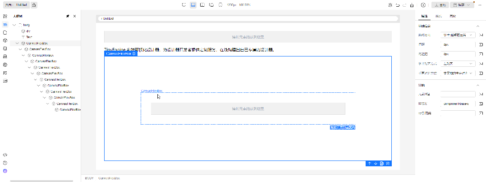

# 查看大纲树

在左侧插件栏中，单击，展开并查看页面大纲树。

##  大纲树UI展示
   

## 节点支持拖拽

大纲树节点支持拖拽，下面是一个最基础的拖拽文本到div容器的例子

   

拖拽时鼠标悬停节点即拖拽目标节点。拖拽交互分为三类：拖拽为目标节点的子节点、拖拽为目标节点的前一个兄弟节点、拖拽为目标节点的后一个兄弟节点。UI分别为如下表示：

将Text节点拖拽为div节点的子节点。拖拽为目标节点的子节点时，目标节点显示全部边框

   

将Text节点拖拽为div节点的前一个兄弟节点。拖拽为目标节点的前一个兄弟节点时，目标节点显示上边框

   

将Text节点拖拽为div节点的后一个兄弟节点。拖拽为目标节点的后一个兄弟节点时，目标节点显示下边框

   

另外如果禁止拖拽，则目标节点的背景色会高亮警告。如下图所示，将div节点拖拽为Text节点的子节点是行不通的

   

禁止拖拽的逻辑和画布是保持一致的，由物料组件的 isContainer 和 nestingRule 属性决定。目标节点对应的组件的属性 isContainer 为 True 是允许其他节点拖拽为目标节点的子节点的前提条件，nestingRule 请参考物料资产包协议中的组件属性信息结构规范章节

## 大纲树嵌套深度很深时，显示横向滚动条

   

## 大纲树支持复制、删除、多选能力

长按 ctrl + 鼠标单击，可支持元素多选，多选节点后可以结合快捷键可以实现批量复制、粘贴、删除操作，多选选中的节点在大纲树和画布会同步显示。如下图所示

   

另外还给大纲树补充了几个其他常用的快捷键，具体看如下表格

| 大纲树支持的快捷键  | 功能说明 | 支持多选 |
| --------- | -------- | ------------- |
| ctrl+鼠标点击 | 选择多个节点。如点击已选中节点后，则为取消选中       | 否 |
| ctrl+c       | 复制节点           | 是 |
| ctrl+v       | 粘贴节点           | 是 |
| ctrl+x       | 剪切节点           | 是 |
| delete       | 删除节点           | 是 |
| ctrl+z       | 撤销历史记录       | 否 |
| ctrl+y       | 回退历史记录       | 否 |
| ctrl+s       | 保存页面schema     | 否 |

