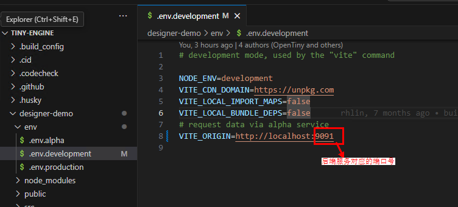
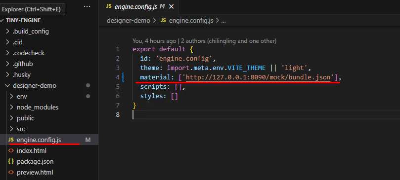
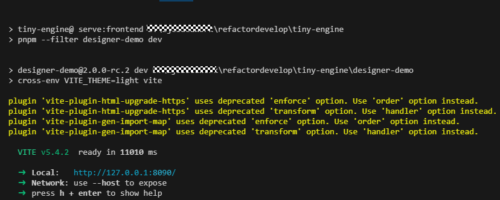
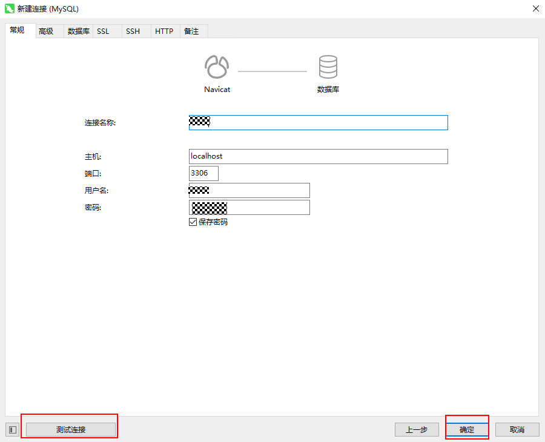
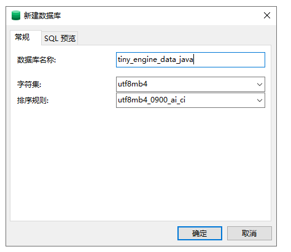
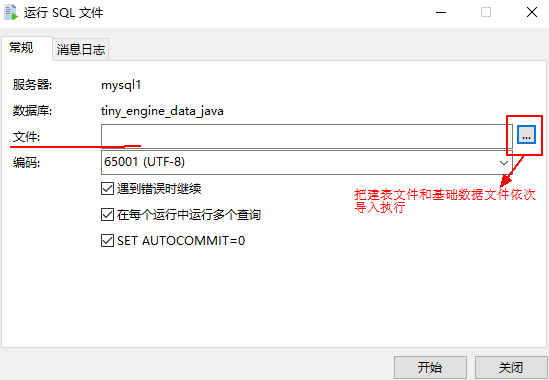
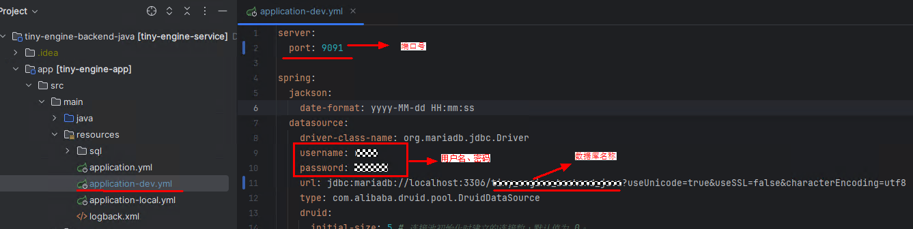
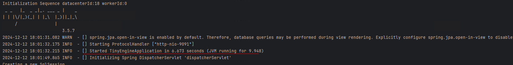
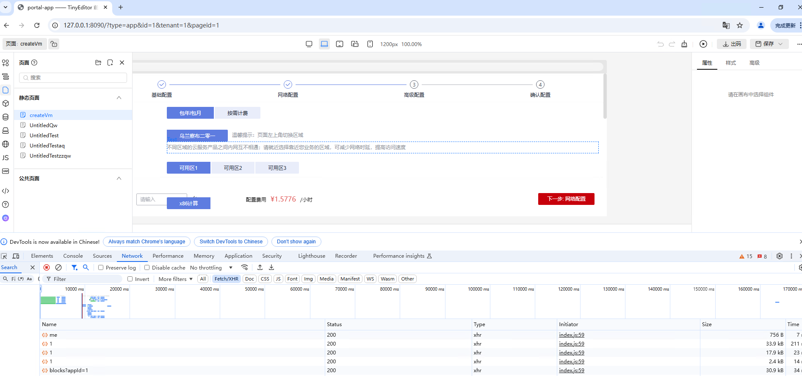
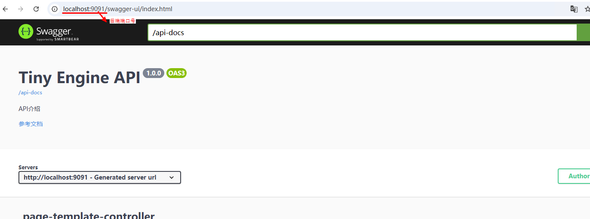

# 前后端代码本地启动联调

本篇主要介绍在本地启动TinyEngine前端并对接本地Java版本后端方式（默认为前端使用mockServer方式）进行开发联调。

Tips：
- 对接Node.js版本服务端与Java版本服务端过程类似。另外Node.js版本后续不再进行新特性开发，只维护基础功能，建议使用Java版本服务端。
- 本篇以Clone前端源码方式启动为例，使用CLI创建新设计器启动前端方式对接后端与之类似。

## 启动前的准备

- clone tiny-engine：[代码仓库](https://github.com/opentiny/tiny-engine/tree/refactor/develop)
- clone tiny-engine-backend-java：[代码仓库](https://github.com/opentiny/tiny-engine-backend-java)

## 启动服务

### 1.前端启动

- 把前端项目工程导入 vscode 后下载依赖，进入项目根目录下执行  `pnpm i`

- 在项目根目录下执行构建`pnpm run setup`

- 修改文件配置

修改`tiny-engine/designer-demo/env/.env.development`中的 VITE_ORIGIN 变量为自己本地的服务端地址端口

修改`tiny-engine/designer-demo/engine.config.js`中的 material 获取物料组件

- 在项目根目录下执行启动`pnpm run serve:frontend`

出现如下图所示表示启动成功，启动成功后浏览器会自动打开设计器页面

### 2.后端启动

#### 新建数据库

**步骤 1 鼠标右键选择“新建连接”->“MySQL”->“下一步”->输入连接名称、用户名、密码->“测试连接”->“确定”**

如下图所示

**步骤二 在步骤一新建的连接上右键选择“新建数据库”->输入数据库名称**

如下图所示

#### 执行脚本文件

**步骤一   在按照上述操作后的新建的数据库名称上右键选择“运行 SQL 文件”->在文件项选择下面两个 SQL 文件导入运行**

如下图所示

执行以下 SQL 文件去创建设计器涉及的表，目录如下:

`tiny-engine-backend-java/app/src/main/resources/sql/mysql/create_all_tables_ddl_v1.mysql.sql`

执行以下 SQL 文件去添加表的基础数据，目录如下：

`tiny-engine-backend-java/app/src/main/resources/sql/mysql/init_data_for_test.sql`

#### 修改数据库等相关的配置项

在`tiny-engine-backend-java/app/src/main/resources/application-dev.yml`文件中设置自己的端口号 port(和前端`tiny-engine/designer-demo/env/.env.development`文件中的 VITE_ORIGIN 变量中的端口号保持一致)、还有数据库连接信息（用户名 username、密码 password、URL）

#### 启动后端项目

步骤一   先安装 maven，若没有从[Maven 官网](https://maven.apache.org/download.cgi)下载并解压，Maven 3.5 以上即可，并配置环境变量

步骤二 在项目根目录执行构建打包`mvn clean package`

步骤三 在项目根目录执行启动`java -jar app/target/tiny-engine-app-1.0-SNAPSHOT.jar`

按照以上步骤执行前后端操作，即能成功启动本地前后端关联进行调试

前后端启动成功后页面会自动弹出，如下可看连接数据库数据接口调通能返回正常数据

三、swagger 访问链接路径:
`localhost:9091/swagger-ui.html`

**可详细查看接口 api**

