# AI 插件使用前配置

## 一、AI 插件使用在本地代码里调试及要改动的配置，以文心一言举例

### 后端代码改动

1、在`tiny-engine-webservice/config/config.default.ts`文件变更如下

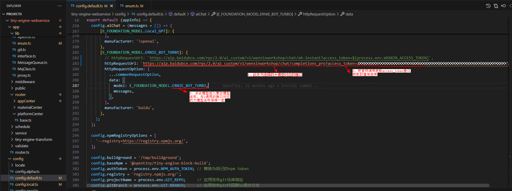

**想获取以上 access_token 值，请看最后标题的“使用前先获取 access_token，拿文心一言举例”**

2、在`tiny-engine-webservice/app/lib/enum.ts`文件变更如下

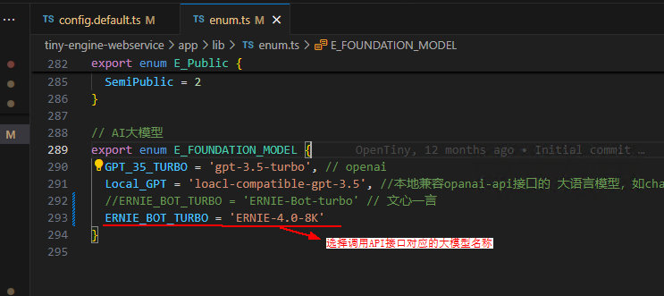

### 前端代码改动

在`tiny-engine/packages/plugins/robot/src/js/robotSetting.js`文件改动如下

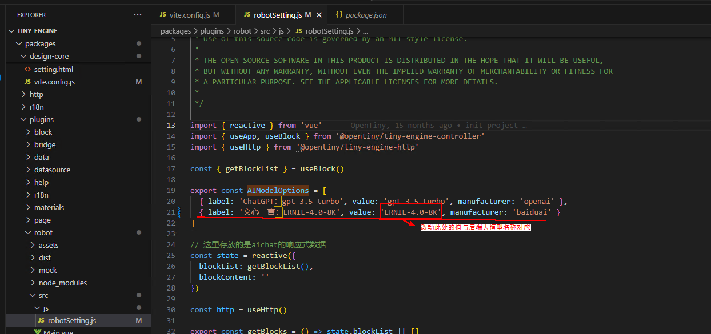

- ### 前后端代码启动后使用 AI 插件

1、点击 AI 对话框

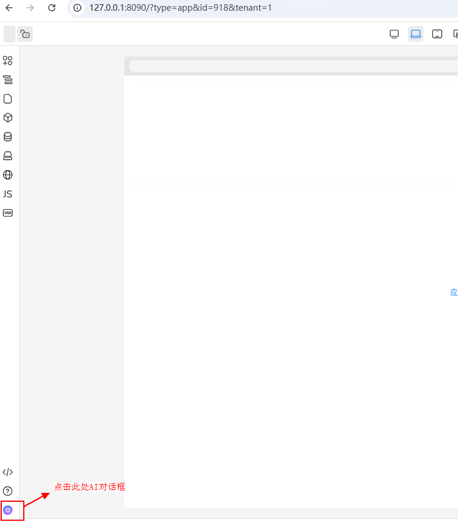

2、在对话框里选择使用的 AI 模型
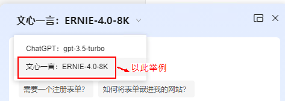

3、输入问题，即能成功回答

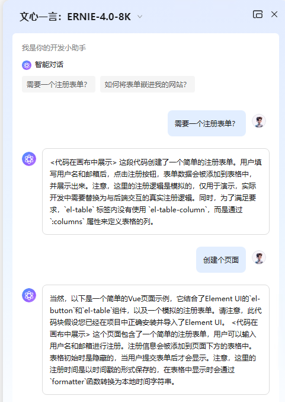

### 使用前先获取 access_token，拿文心一言举例

1、在网上搜索[文心一言 API 使用教程](https://blog.csdn.net/weixin_73654895/article/details/133799269)，按照操作[登录百度智能云](https://login.bce.baidu.com)后先[创建应用](https://console.bce.baidu.com/qianfan/ais/console/applicationConsole/application/v1)申请一个 API 获取密钥

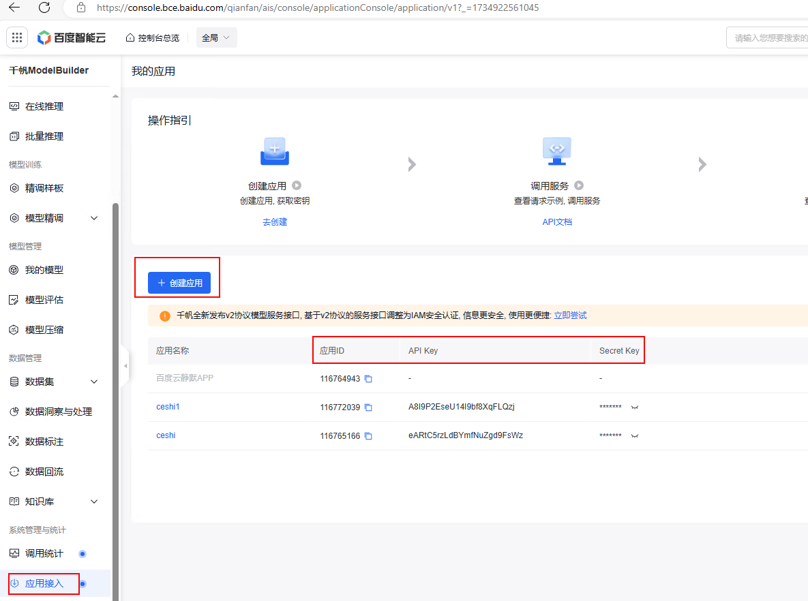
2、在线调试[获取 access_token](https://cloud.baidu.com/doc/WENXINWORKSHOP/s/llkkrb0i5)

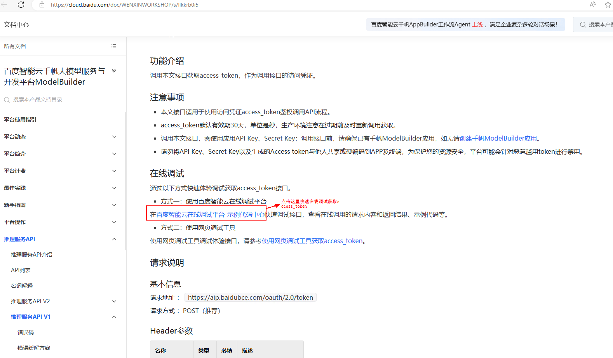
跳转到[进入示例代码中心调试调用 API 获取 access_token](https://console.bce.baidu.com/support/?u=qfdc#/api?product=QIANFAN&project=千帆ModelBuilder&parent=鉴权认证机制)

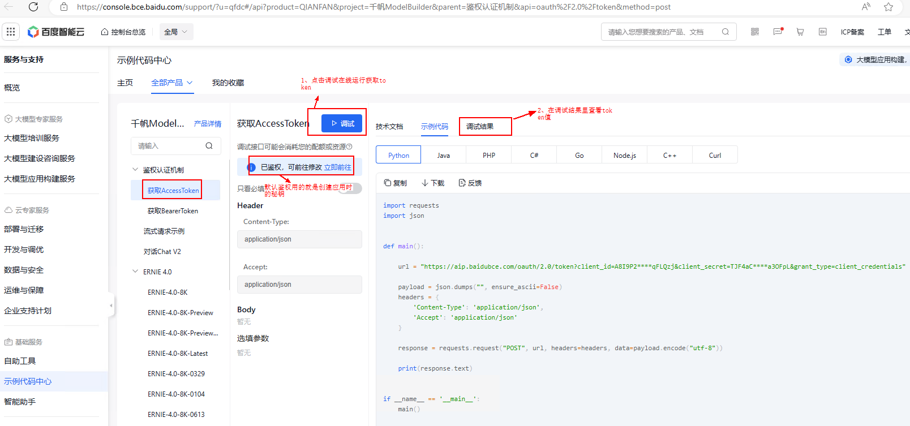

查看 access_token 值，下图可看到在线运行成功，成功获取 token 值

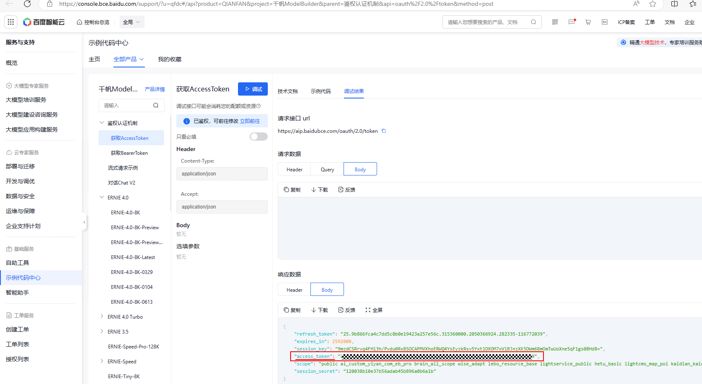

3、调用 API 接口

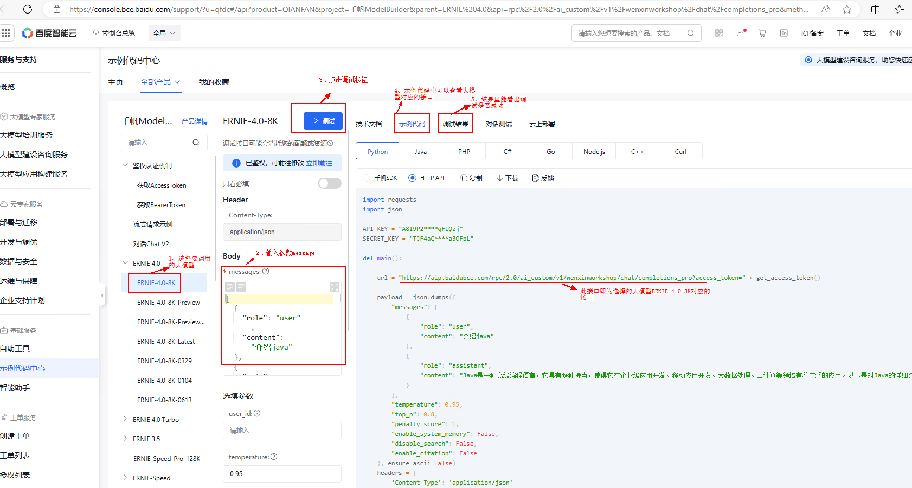
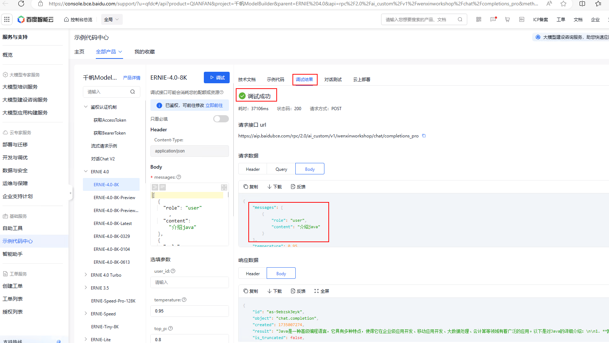
