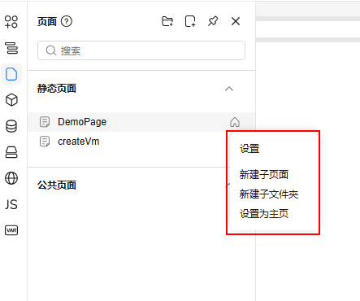
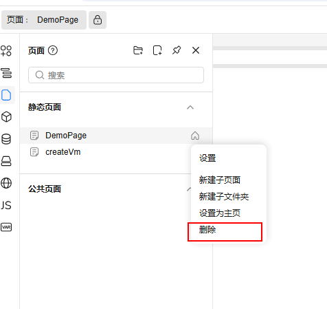

# 页面操作菜单支持配置

我们提供了页面操作菜单增加自定义操作

当前是默认操作菜单项



## 通过配置项来定制

- `customPageOperations`：自定义操作配置项
- `type`：菜单项类型
- `label`：菜单项名称
- `action`：菜单项操作

```js
// registry.js
import { handleClickDelete } from './tests/utils'
export default {
  // ...
  plugins: [
    // ...
    [Page, { options: { ...Page.options, customPageOperations: [{type: 'delete', label: '删除',  action: handleClickDelete}] } }]
    // ...
  ]
  // ...
}
```



方法中传有两个参数

```js
export const handleClickDelete = async (node, emit) => {
  // node 为所选择的页面的信息， 可以直接调接口处理数据
  // emit 可以调用页面父组件的方法，例如 在选择的页面下新建子页面  emit('createPage', 'staticPages', node.id)
}
```


