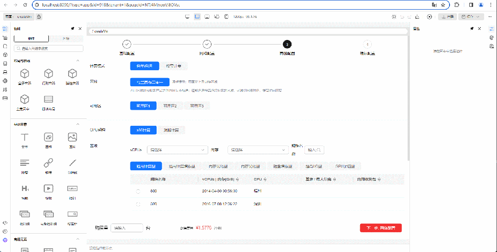
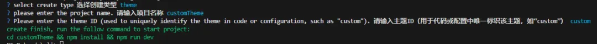
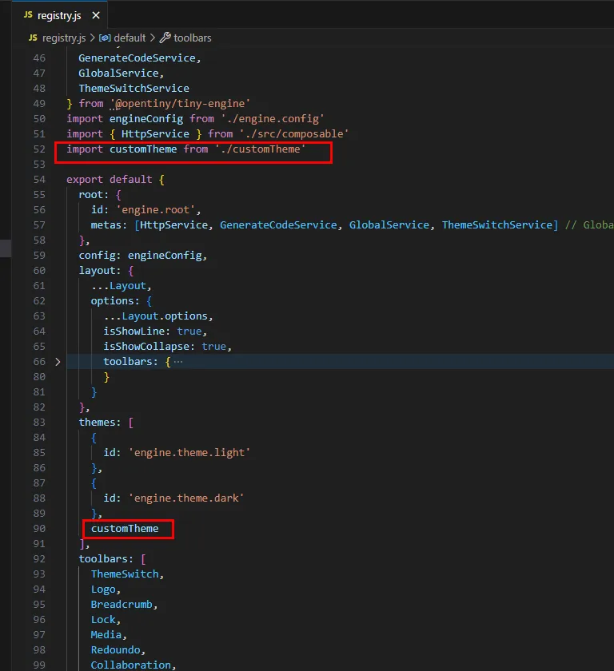
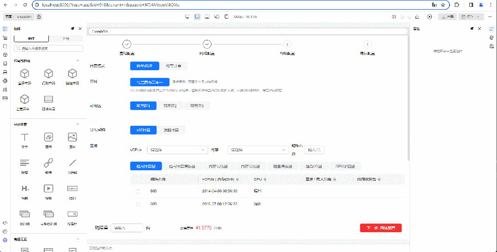

# 自定义主题

## 默认主题切换

默认提供了深色和浅色主题，通过顶部主题切换插件点击图标即可进行切换



## 自定义主题

用户在注册表配置自定义主题，主题切换展示为列表切换

• 创建设计器可参考官网文档：https://opentiny.design/tiny-engine#/help-center/course/dev/dev-quick-start

• 在已经创建的设计器根目录执行engine-cli create，选择theme以创建一个新的主题

```shell
npx @opentiny/tiny-engine-cli create

# 上面命令默认会拉取最新的版本，也可以指定版本号
npx @opentiny/tiny-engine-cli@2.4.0 create
```



执行下面命令安装依赖

```shell
# 安装依赖
npm install
```

• 将主题接入设计器

使用vs Code 打开 customPlatform 项目，修改 registry.js



• 开发调试主题

重新打开项目页面，可以看到主题展示为列表切换，可以切换自定义主题

