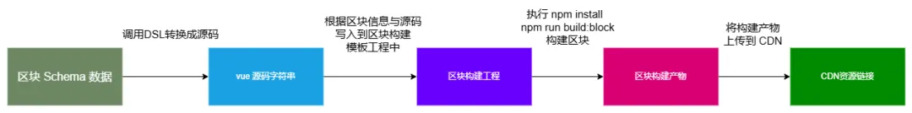
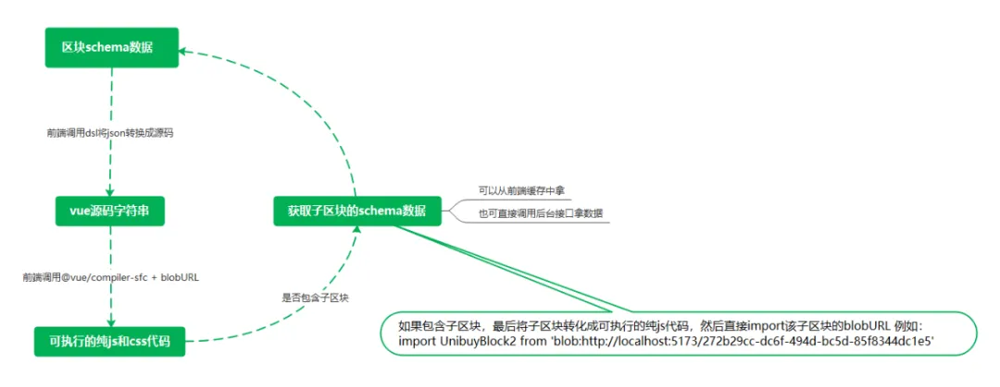

# 全新区块构建方案

> TinyEngine v2.1 起支持

原来的区块构建发布方案中，区块发布构建需要经过：

a. 后端得到区块 schema，调用 DSL 进行出码。

b. 将出码写入到区块模板工程中。

c. 执行 npm install 安装依赖。

d. 执行 npm run build:block 构建区块，得到 dist 中的目标产物。

e. 将得到的产物上传到自部署的 unpkg cdn 托管平台。

原区块构建方案示意图如下：

原区块构建发布方案有以下痛点：

需要搭建自部署的 unpkg cdn 托管平台，对很多前端同学来说，有一定的门槛。

每次的构建发布过程中，都需要经过出码 -> 依赖安装 -> 构建 -> 上传产物的复杂流程（即使是仅改动了一个字符！），耗费了一定的时间，不利于敏捷开发。

新方案简要流程为：

a. 得到区块 schema，调用 DSL 进行出码。

b. 根据出码，调用 @opentiny/tiny-engine-block-compiler 构建区块，得到区块的模块代码（blob url 形式）。

c. 画布使用异步组件加载得到的模块代码。

新区块构建方案示意图如下：

于是，经过新方案的改造之后，我们区块的构建速度从分钟级提升到了秒级，大幅提高开发效率。

## 后端发布接口支持：

- Java 版本：已经支持
- Node.js 后端：如果是 fork Node.js 后端的用户需要使用 TinyEngine v2.1.0 新特性 ，更多细节请查看 PR [https://github.com/opentiny/tiny-engine-webservice/pull/25](https://github.com/opentiny/tiny-engine-webservice/pull/25)