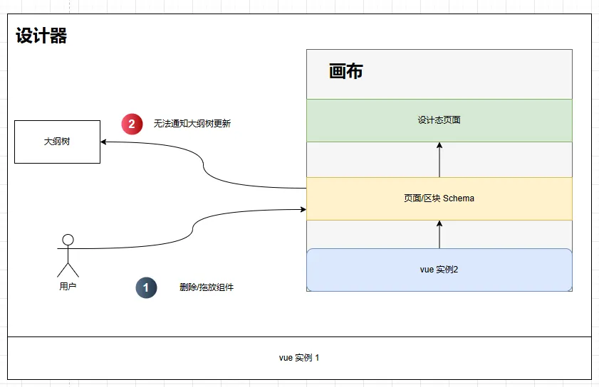
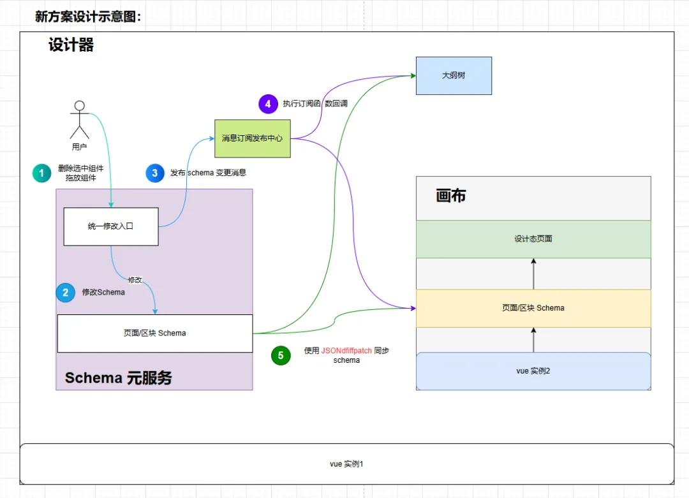

# 全新画布通信方案

原来的画布通信方案中，我们直接拿到在画布中的 schema 引用，并直接修改，比如修改组件的属性或者插入删除组件等。

原方案的好处是：修改 schema 可以直接快速触发画布渲染，快速且高性能。

但是原方案有一个明显的硬伤是：插件无法监听 schema 的变动，比如，我们固定了大纲树面板的时候，在画布中拖拽改变组件的顺序，大纲树由于无法监听 schema 的变动，导致无法响应式地自动更新大纲树。



于是，为了满足原来画布快速高性能渲染要求，同时可以让插件监听 schema 的变动，执行插件自身的逻辑，满足后续更多可扩展插件的需求，我们推出了一种新的画布通信方案：



新方案核心要点：

• 使用事件发布订阅来通知 schema 变更。

• 使用 JSONdiffpatch 同步 iframe 中画布 schema 与 iframe 外 schema 的差异。


## schema 元服务相关API（Experimental）

### 直接修改 schema 引用 & 调用通知更新

使用示例：

```javascript
import { useCanvas, useMessage } from '@opentiny/tiny-engine-meta-register'

const pageSchema = useCanvas().getPageSchema()

pageSchema.css = "xxxx"

useMessage().publish({ topic: 'schemaChange' })
```

注意：直接修改 schema 引用当前不能涉及到节点的增加、删除，不然会节点树 nodesMap 无法更新，导致画布无法选中新增的组件。


> 注意：以下所有 API 皆为 Experimental 实验 API，请不要用在生产阶段

## 导入/导出 schema

> 这里的导入导出仅包含页面级别，不包含应用级别 schema

**导入 schema:**

```javascript
import { useCanvas } from '@opentiny/tiny-engine-meta-register'

const data = { /*页面/区块 schema*/ }

useCanvas().importSchema(data)
```

**导出 schema:**

```javascript
import { useCanvas } from '@opentiny/tiny-engine-meta-register'

useCanvas().exportSchema()
```

## 页面 schema相关操作

> 主要描述对页面 schema 的增删查改操作

### 获取当前页面/区块 schema:

```javascript
import { useCanvas } from '@opentiny/tiny-engine-meta-register'

useCanvas().getPageSchema()
```

### 获取当前选中节点 schema:

```javascript
import { useProperties } from '@opentiny/tiny-engine-meta-register'

const schema = useProperties().getSchema()
```

### 根据 id 查询对应的 节点schema(schema 片段)

```javascript
import { useCanvas } from '@opentiny/tiny-engine-meta-register'

const schema = useCanvas().getNode('453254', false)
```

类型：

```typescript
/**
 * 根据节点 id 获取 schema 片段
 * id: schema id
 * parent: 是否需要同时获取 parent 节点
 */
type getNode = (id: string, parent: boolean) => INode | { node: INode; parent: INode }
```

### 节点操作

#### 插入节点

使用示例：

```javascript
import { useCanvas } from '@opentiny/tiny-engine-meta-register'

useCanvas().operateNode({
  type: 'insert',
  parentId: '432423',
  newNodeData: { componentName: 'div', props: {}, children: [] },
  position: 'after',
  referTargetNodeId: '898432'
})
```

类型：

```typescript
interface IInsertOperation {
  // 操作类型为 insert
  type: 'insert';
  // 要插入的节点的 父节点 id
  parentId: string;
  // 新节点数据
  newNodeData: INode;
  // 相对节点的 id，比如我们想要插入父节点 id 中 第 5 个 children 的后面，或者前面
  referTargetNodeId: string;
  // 相对节点的位置
  position: 'after' | 'before';
}
```

#### 删除节点

使用示例：

```javascript
import { useCanvas } from '@opentiny/tiny-engine-meta-register'

useCanvas().operateNode({
  type: 'delete',
  id: '432423'
})
```

类型：

```typescript
interface IDeleteOperation {
  type: 'delete';
  id: string;
}
```

#### 修改节点 props

使用示例：

```javascript
import { useCanvas } from '@opentiny/tiny-engine-meta-register'

useCanvas().operateNode({
  type: 'changeProps',
  id: '432423',
  value: { text: 'TinyEngine' },
  option: { overwrite: false }
})
```

类型：

```typescript
interface IChangePropsOperation {
  type: 'changeProps';
  // 节点 id
  id: string;
  // 新的 props 值
  value: Record<string, any>;
  // 操作类型：是否覆写
  option: { overwrite: boolean; }
}
```

#### 更新节点属性

使用示例：

```javascript
import { useCanvas } from '@opentiny/tiny-engine-meta-register'

useCanvas().operateNode({
  type: 'updateAttributes',
  id: '432423',
  value: { props: { ... }, loop: { ... } },
  overwrite: boolean
})
```

类型：

```typescript
interface IUpdateAttrOperation {
  type: 'updateAttributes';
  id: string;
  // 对节点的属性修改
  value: Record<string, any>;
  // 是否是直接覆盖
  overwrite: boolean;
}
```
