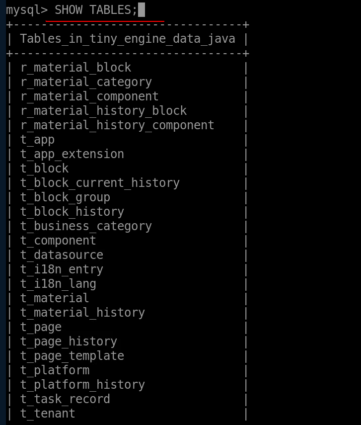

# Java 服务端部署到服务器

## 1、配置服务器环境

以 Linux 类型 Huawei Cloud EulerOS 为例

- **安装 jdk 8**

```
suto yum install java-1.8.0-openjdk-devel
```

安装完成后，可以使用`java -version`命令来验证 JDK 是否安装成功

设置环境变量，在~/.bash_profile 文件中添加以下内容

```
export JAVA_HOME=/usr/lib/jvm/java-1.8.0-openjdk
export PATH=$JAVA_HOME/bin:$PATH
```

再使用 source 命令使配置生效`source ~/.bash_profile`

- **安装 maven** `suto yum install maven`

若执行命令后报错如下，那么就进行手动安装


手动安装 maven

1、添加 EPEL 仓库

maven 可能不在默认的仓库里，但在 EPEL（Extra Packages for Enterprise Linux）仓库中可以找到，因此首先安装 EPEL 仓库`sudo yum install epel-release`,安装完成后尝试重新安装 maven `sudo yum install maven`

若报错如下图，继续以下步骤


2、从 Apache Maven 官方网站下载 Maven

可以用 wget 下载到你服务器上，例如下载 maven 3.9.9 版本 wget `https://downloads.apache.org/maven/maven-3/3.9.9/binaries/apache-maven-3.9.9-bin.tar.gz
`


3、解压并安装 maven

- 解压下载的 tar 文件`tar -zxvf apache-maven-3.9.9-bin.tar.gz`

- 将 maven 移动到喜欢的位置，例如 tinyengine/maven,进入 tinyengine/maven 路径下执行`sudo mv /root/apache-maven-3.9.9 .`

  

4、设置环境变量

在~/.bash_profile 文件中添加以下内容

```
export M2_HOME=/root/tinyengine/maven
export M2=$M2_HOME/apache-maven-3.9.9/bin
export PATH=$M2:$PATH
```

再使用 source 命令使配置生效`source ~/.bash_profile`

5、验证 maven 安装是否成功`mvn -version`

如果一切正常将会看到 maven 的版本信息，如下图所示


- **安装 mysql**

1、添加 mysql 仓库

首先下载并添加 mysql 仓库 wget` https://dev.mysql.com/get/mysql80-community-release-el7-3.noarch.rpm`

2、安装 mysql 仓库`sudo rpm -ivh mysql80-community-release-el7-3.noarch.rpm`

3、安装 mysql`sudo yum install mysql-server`

4、启动 mysql 服务并设置为开机自启动

```
sudo systemctl start mysqld
sudo systemctl enable mysqld
```

若启动 mysql 报错查看 mysql 日志`cat /var/log/mysqld.log`,如下图所示，端口 3306 已占用


执行`lsof -i :3306`查看端口占用情况，以下可以看出 docker-pr 进程正在占用 mysql 默认的 3306 端口


修改 mysql 配置文件/etc/my.cnf 中端口号，再重新启动 mysql`sudo systemctl restart mysqld`


5、查看 mysql 是否安装`mysql -V`


6、查看 mysql 服务状态，以下表示正在运行`sudo systemctl status mysqld`


## 2、登录 mysql 创建数据库并执行 SQL 文件

- 登录执行`sudo mysql -u root -p`,输入密码，若忘记想重置密码进行以下步骤：

1、以系统管理员身份登录进入 mysql `sudo mysql`

2、重置 root 用户密码`ALTER USER 'root'@'localhost' IDENTIFIED BY 'new_password';`

`'new_password'`为设置的新密码

3、退出 mysql `exit;`

4、用新密码重新登录`sudo mysql -u root -p`

- 创建数据库 `CREATE DATABASE tiny_engine_data_java;`

  

- 查看是否创建成功`SHOW DATABASES;`

  

- 切换数据库`USE tiny_engine_data_java;`
  

- 执行 SQL 创表文件`source /root/tiny-engine-backend-java/app/src/main/resources/sql/mysql/create_all_tables_ddl_v1.mysql.sql;`

  

- 执行 SQL 初始化数据文件`source /root/tiny-engine-backend-java/app/src/main/resources/sql/mysql/init_data_for_test.sql;`


- 检查是否执行成功`SHOW TABLES;`



## 3、克隆 Java 项目并启动

- 在 github 上通过生成 access_token 下载代码到虚拟机上

  

- 在项目根目录运行构建命令`mvn clean package`生成 jar 包，生成的 jar 包文件目录在`tiny-engine-backend-java/app/target`下的 tiny-engine-app-1.0-SNAPSHOT.jar


- 在 tiny-engine-backend-java/app 下执行`java -jar target/tiny-engine-app-1.0-SNAPSHOT.jar`启动工程


