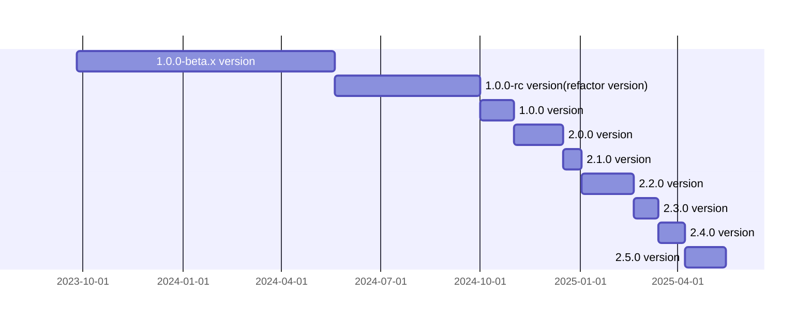

<p align="center">
  <a href="https://opentiny.design/tiny-engine" target="_blank" rel="noopener noreferrer">
    
  </a>
</p>

<p align="center">TinyEngine enables developers to customize low-code platforms, build low-code platforms online in real time, and support secondary development or integration of low-code platform capabilities.</p>

English | [简体中文](https://github.com/opentiny/tiny-engine/blob/develop/README.zh-CN.md)

🌈 Features:

- Cross-end cross-frame front-end components
- Supports online real-time construction, secondary development, or being integrated.
- Directly generate deployable source code without engine support.
- Allows access to third-party components and customized extension plug-ins.
- Supports high-code and low-code, and hybrid development and deployment of applications.
- The platform accesses LLM capabilities to help developers build applications.

## Documentation

- intro：https://opentiny.design/tiny-engine#/home
- tutorial：https://opentiny.design/tiny-engine#/help-center/index
- playground：https://opentiny.design/tiny-engine#/tiny-engine-editor

## Usage

### Environment Setup

- Install Node.js 18+

- Install pnpm 9+

```sh
$ npm install -g pnpm
```

### Create Low-Code Platform using CLI

```sh
# Create low-code platform
$ npx @opentiny/tiny-engine-cli@latest create-platform <name>
# Enter the low-code platform directory
$ cd <name>
# Install dependencies
$ pnpm install
```

### Local development: Start the local mock server and use the mock data of the local mock server.

> The mock server included with the created low-code platform only provides basic backend mock functionality. If you need to experience the complete backend service capabilities, please refer to the Java backend startup instructions below.

```sh
$ pnpm dev
```

### Local Development with Java Backend

Java backend repository: https://github.com/opentiny/tiny-engine-backend-java

Start Java backend for frontend-backend integration:

[Frontend-Backend Integration Documentation](https://opentiny.design/tiny-engine#/help-center/course/dev/debugging-of-java-backend)

### Materials Synchronization [Solution](https://opentiny.design/tiny-engine#/help-center/course/dev/material-sync-solution)

```sh
$ pnpm splitMaterials
```

```sh
$ pnpm buildMaterials
```

Open a browser: `http://localhost:8080/?type=app&id=1&tenant=1&pageid=1`
`url search` Parameters:

- `type=app` Application type
- `id=xxx` Application ID
- `tenant=xxx` Organization ID
- `pageid=xxx` Page ID

## Build

```sh
# Build Designer
pnpm run build:alpha or build:prod
```

## Milestones



## 🤝 Participation and Contribution

If you are interested in our open source project, please join us! 🎉

Please read the [Contribution Guide](https://github.com/opentiny/tiny-engine/blob/main/CONTRIBUTING.md) before participating in the contribution.

- Add official assistant WeChat opentiny-official and join the technical exchange group
- Join the mailing list opentiny@googlegroups.com

## ❤️ Acknowledgments

Thanks to all the developers who have contributed to TinyEngine!

<p align="center">
  <a href="https://github.com/opentiny/tiny-engine/graphs/contributors" target="_blank">
    
  </a>
</p>

## License

[MIT](LICENSE)